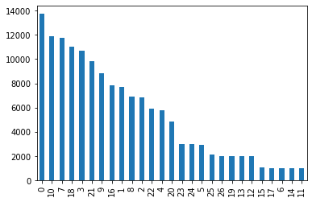
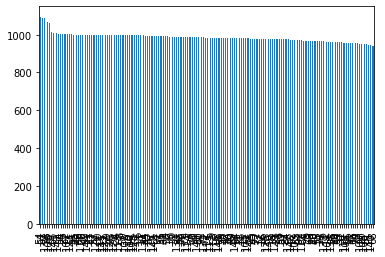

# KFoodDataset

## Overview

`dataset.py` contains KFood-27 dataset and KFood-150 dataset. To use dataset, you should copy the `meta.csv` file into the root of the data directory.

## Statistics

- Image mean: (0.1967, 0.1685, 0.1364)
- Image std: (0.1016, 0.0835, 0.0692)

| KFood-27 | KFood-150 |
|---|---|
||  |
